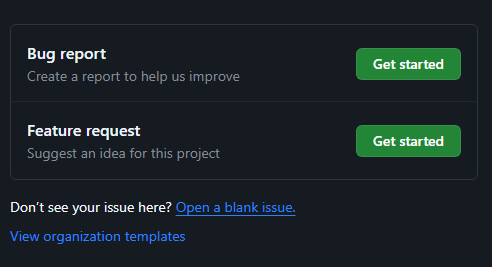

# Contribute to Digitomize

Hey! Thanks for considering contributing to Digitomize. We're excited to have you contribute.&#x20;


Digitomize is open to first-time open source contributions. Be sure to go through this guide to get all the information you need.


### Getting Started.

Before you get started, be sure to check out the [Code of Conduct](code-of-conduct.md). This will ensure we maintain a positive and welcoming community.

### How to Contribute to Digitomize

You are welcome to contribute by:

* [Reporting bugs](https://app.gitbook.com/o/ekMF9zG3tvNrhkhDZTBE/s/S29E4JrAA1b3pzZaElxO/\~/changes/11/contribute-to-digitomize#reporting-bugs)
* [Suggesting features and improvements](https://app.gitbook.com/o/ekMF9zG3tvNrhkhDZTBE/s/S29E4JrAA1b3pzZaElxO/\~/changes/11/contribute-to-digitomize#suggesting-enhancements)
* [Creating pull requests](https://app.gitbook.com/o/ekMF9zG3tvNrhkhDZTBE/s/S29E4JrAA1b3pzZaElxO/\~/changes/11/contribute-to-digitomize#creating-pull-requests)

#### Reporting Bugs

If you encounter a bug or unexpected behavior, please [open an issue](https://github.com/digitomize/digitomize/issues/new/choose) by following the following steps:

1. Open a new issue
2. Choose the type of issue (bug report)

<figure><figcaption></figcaption></figure>

3. Provide all the details required based on the template. &#x20;

These details include:

* a description of the bug
* the expected behavior and actual behavior
* how to recreate the bug
* screenshots (if any)

#### Suggesting Enhancements

If you have an idea that can improve the Digitomize platform, please [open an issue](https://github.com/digitomize/digitomize/issues/new/choose) by following the following steps:

1. Open a new issue
2. Choose the type of issue (feature request)

<figure><figcaption></figcaption></figure>

3. Provide all the details required based on the template. &#x20;

These details include:

* a description of the feature
* the features use cases
* how the feature will improve Digitomize

#### Creating pull requests

If you're interested in making a contribution, follow these steps to submit a pull request:

1. Find an open issue that interests you
2. Fork the [Digitomize repository](https://github.com/digitomize/digitomize/) and create a branch where you will make your changes
3. Follow [the setup instructions](../local-development-setup/)
4. Make your changes and commit them with descriptive messages
5. Run `npm run eslint` in the root project to make sure your contributions align with our coding guidelines
6. Run `npm run eslint-fix` in the root project to allow ESLint to fix any issues
7. Push your changes to the forked repository
8. Open a pull request from your branch to the main upstream branch
9. Provide a clear description of your changes and why they are valuable&#x20;

Please ensure your code aligns with the Coding Guidelines below.


If you have any issues contributing, the Digitomize community is open to helping you make a successful contribution. You can join [our Discord Community](https://digitomize.com/discord)


### Coding Guidelines

* Follow the established coding style and conventions.
* Write clear and concise code with meaningful comments when necessary.
* Test your changes thoroughly before submitting a pull request.
* Document new features, changes, or important concepts as needed.

### Contact Digitomize

Feel free to get in contact with us. Find our contact details [here.](contact-digitomize.md)

### License

The Digitomize project is under the MIT License. For more information about our license, [check it out here.](https://github.com/digitomize/digitomize/blob/LICENSE)
